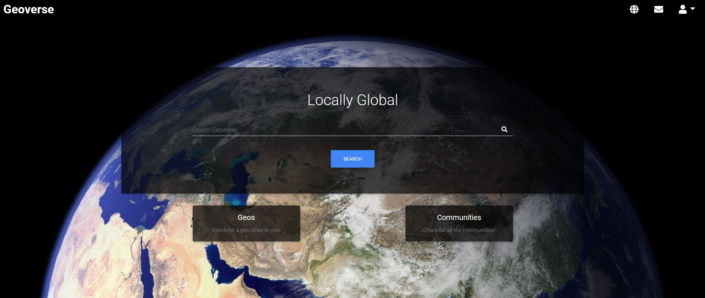

# Welcome to Geoverse

<br />

#### Bringing the Global, local!

## Description

The Geoverse is a nod to the '90s Geo-cities. In a world over-saturated with social media, we've tried to bring a modern spin to an old classic, that focuses more on where we are, and our shared interests.

It utilises a range of npm packages to highlight the wide berth of skills in full stack development which have been learned, to bring a functional, and hosted full stack app. We have combined a MySQL and NoSQL approach to deliver a content sharing and user interaction service with direct messages, live wall posting (future development pending) and a collection of user made HTML pages to share and search for in Geoverse.

## Contents

- [Installation](#installation)
- [Usage](#usage)
- [User Story](#user-story)
- [Demonstration](#demonstration)
- [Future Developments](#future-developments)
- [Screenshots](#screenshots)
- [Questions](<#questions-(FAQ)>)
- [Contact](#contact)
- [Authors](#authors)
- [Acknowledgements](#acknowledgements)

## Installation

1. Clone the GitHub repository to explore files locally. Run npm i --save for dependencies. (Note: Due to the use of Firebase, a unique key is need and would need to be set up with a personal key):

```
git clone https://github.com/AGr2020Xman/community-hub-project.git
```

2. For normal use of app - visit deployed application on Heroku.

## Usage

Locally hosted on [http://localhost:3001](http://localhost:3001) as per configuration.

For normal usage - see [deployed app](https://community-hub-project.herokuapp.com/).

## User Story

```
AS a User
I WANT TO locate communities with individuals that share my interests
SO I CAN share my own interests, meeting new people within a certain vicinity to me or around the world.

```

## Demonstration

- [Deployed application on heroku](https://community-hub-project.herokuapp.com/)

## Future Developments

- Solving the case sensitivity of live-wall
- SendGrid email message system
- End-to-end testing of the application
- Error handling improvements
- UI polishing
- Robust admin tools
- AboutUs / Contact administrators
- User account admin tools

## Screenshots

_The Geoverse, a modern twist on a scaled back social platform_

- 

_Login in securely_

- 

_Signup accounts and choose your own nickname_

- 

_Search for communities in active geo-locations_

- 

_Find user sites in your favourite communities_

- 

_See communities from different geo-verses!_

- 

_Message new people, or your friends with inbuild direct messaging_

- 

_Change your personal details, or delete your account_

- 

## Questions

- Submit questions to developers - contact details below.

## Contact

- Contact us with any questions on our emails:
  - agre.fun21@gmail.com
  - harishnarain@gmail.com
  - atif.haque@gmail.com

## Authors

- Andr&eacute; Grech - [https://github.com/AGr2020Xman](https://github.com/AGr2020Xman)
- Harish Narain - [https://github.com/harishnarain](https://github.com/harishnarain)
- Atif Haque - [https://github.com/atifih](https://github.com/atifih)

### Acknowledgements

- © 2019 Trilogy Education Services, a 2U, Inc. brand. All Rights Reserved.
